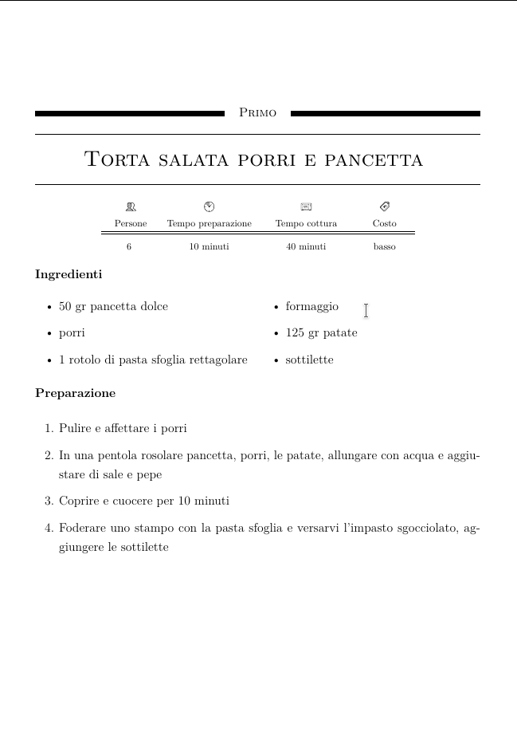

# Ricettario PDF

Questo progetto consente di compilare ed impaginare un ricettario partendo da semplici file markdown-like contenenti le ricette.

## Istruzioni

1. Descrivere la ricetta nel formato markdown-like specificato sotto
2. Ogni ricetta deve essere indicata in un file dedicato
3. I file con le ricette devono essere posti in `recipes/<mode>/<course>/`
4. Eseguire `make <course> MODE=<mode>` per generare il ricettario per le ricette di tipo `<course>`, ad esempio `make primi MODE=old` genererà il PDF con le ricette dei primi poste in `recipes/old/primi/`

La distinzione tra `<mode>` serve per consentire di generare il pdf contenente soltanto le nuove ricette
(poste nella cartella `recipes/new/`)

## Esempio ricetta in formato markdown-like

```
Torta salata porri e pancetta

- persone 6
- preparazione 10
- cottura 40
- costo basso

Ingredienti

- 50 gr pancetta dolce
- porri
- 1 rotolo di pasta sfoglia rettagolare
- formaggio
- 125 gr patate
- sottilette

Preparazione

- Pulire e affettare i porri
- In una pentola rosolare pancetta, porri, le patate, allungare con acqua e aggiustare di sale e pepe
- Coprire e cuocere per 10 minuti
- Foderare uno stampo con la pasta sfoglia e versarvi l’impasto sgocciolato, aggiungere le sottilette

```

## Risultato



